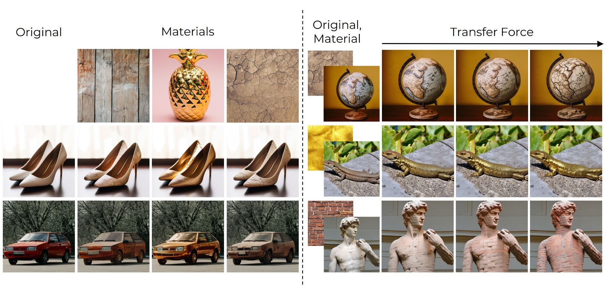
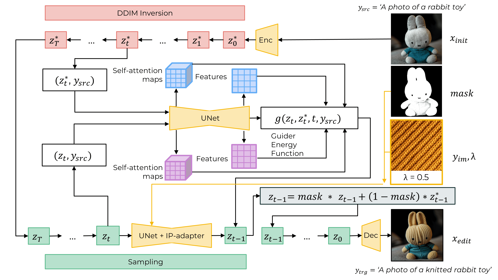

# MaterialFusion: High-Quality, Zero-Shot, and Controllable Material Transfer with Diffusion Models

>Manipulating the material appearance of objects in images is critical for applications like augmented reality, virtual prototyping, and digital content creation. We present MaterialFusion, a novel framework for high-quality material transfer that allows users to adjust the degree of material application, achieving an optimal balance between new material properties and the object's original features. MaterialFusion seamlessly integrates the modified object into the scene by maintaining background consistency and mitigating boundary artifacts. To thoroughly evaluate our approach, we have compiled a dataset of real-world material transfer examples and conducted complex comparative analyses. Through comprehensive quantitative evaluations and user studies, we demonstrate that MaterialFusion significantly outperforms existing methods in terms of quality, user control, and background preservation.
>



## Updates

- [09/02/2025] 🔥🔥🔥 MaterialFusion release.

## Prerequisites

To run our method, please ensure you meet the following hardware and software requirements:
- Operating System: Linux
- GPU: NVIDIA V100 with 40GB RAM
- Python Version: 3.8.5
- PyTorch Version: 2.0.1
- Diffusers Version: 0.29.1

## Setup

In order to setup the environment, run:
```
git lfs install

git clone https://huggingface.co/h94/IP-Adapter 

conda env create -f material_fusion_env.yaml
```
Conda environment `material_fusion` will be created and you can use it.

## Inference

You can use `main.py` to execute the method.

* Here’s an example of how to perform inference:
```
init_prompt="A photo of a car"                            
edit_prompt="A photo of a car"                            
transfer_force="0.1 0.5 0.8 1.0"                          
obj_name="car"                                            
obj_path="./example_images/objects/car.png"              
material_image_path="./example_images/materials/4.jpg"   
config_path='./configs/materialfusion_colab.yaml'        
python main.py --init_prompt "$init_prompt" \
--edit_prompt "$edit_prompt" \
--transfer_force "$transfer_force" \
--obj_name "$obj_name" \
--obj_path "$obj_path" \
--material_image_path "$material_image_path" \
--config "$config_path"
```

## Quickstart

We provide examples of applying our pipeline to real image editing in the [notebook](example_notebooks/material_transfer.ipynb).

## Method Diagram
<p align="center">
  
  <br>
</p>
<p align="center">
  <br>
The overall pipeline of MaterialFusion for material transfer. Starting with DDIM inversion of the target image $x_{init}$ and material exemplar $y_{im}$, the framework combines the IP-Adapter with UNet and employs a guider energy function for precise material transfer. A dual-masking strategy ensures material application only on target regions while preserving background consistency, ultimately generating the edited output $x_{edit}$. The parameter $\lambda$, known as the Material Transfer Force, controls the intensity of the material application, enabling adjustment of the transfer effect according to user preference.
</p>

## References & Acknowledgments

The repository was started from [Guide-and-Rescale](https://github.com/AIRI-Institute/Guide-and-Rescale).

## Citation

If you utilize this code in your research, kindly cite our paper:
```
@article{...}
```